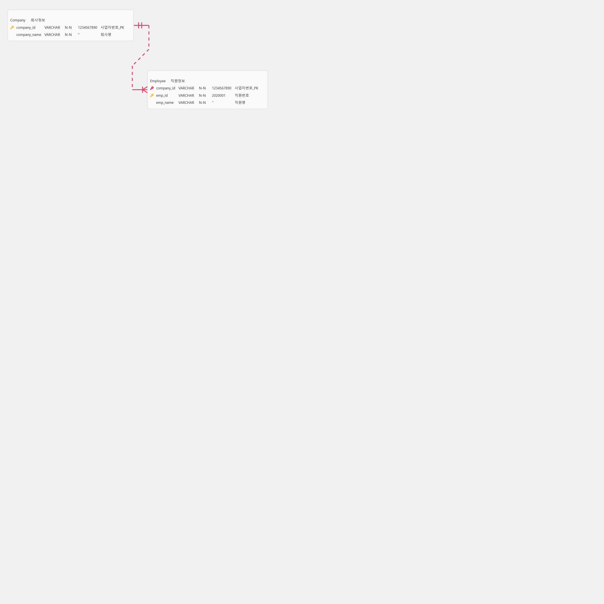
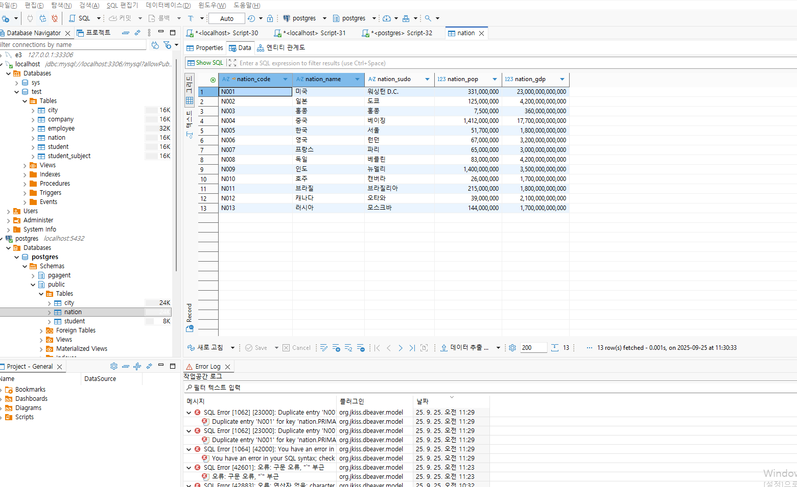

# [DB 설명]
## 포탈 시스템

### 1. 포탈은 전세계의 국가, 도시의 정보를 갖고 있음.
### 2. 도시는 항구도시와 육지 도심 지역으로 항구와 인접하지 않을 수 있습니다.
### 3. 컨테이너선이 컨테이너 수출입 업무를 담당 합니다. 선적,하적의 정보가 있습니다.
### 4. 쇼핑몰은 전세계 제품을 수입, 수출 , 판매 대상의 물건은 마치 아마존과 유사합니다.
### 5. 입점몰 개념으로 쇼핑몰을 운영하는 슈퍼관리자, 몰 관리자가 있습니다. 
### 6. 상품에 대한 정보가 있습니다. 상품은 11번가와 같이 다양하게 카테고리가 있습니다.
### 7. 각 데이타는 로그 이력을 갖게 됩니다. 로그인, 상품이 판매될때, 배가 이동할때 등 모든 데이타의 처리 이력이 있습니다.
### 8. 판매대상의 제품은 WMS 기반의 창고에 물류로 입출고 됩니다. (수불관리)
### 9. 판매 물품의 재고관리를 의미 합니다. 
### 10. 단체 비품 구입처가 있습니다. 초중고 대학교에서 비품을 구매합니다.
### 11. 개인도 구매합니다. 상품의 종류, 단가, 패키지, 장바구니 .. 등 쇼핑몰의 데이타 구조를 다 가지고 있습니다.
### 12. 단체 구입처 에서는 상품에 대한 사용 이력이 학교, 학년, 반 별로 구분되어, 데이타 시각화 화면으로 제공 됩니다.

### 2025.09.24 / ver 0.1
### 작성자 : 홍길동

## ERD

## 기술 스택
### DBMS : MariaDB , MySQL , MSSQL , Oracle , Postgresql 에 모두 테이블링, 데이타를 넣고, 그 데이타를 쿼리 할수 있는 기반

## 평가방법
### 당일 본인이 만든 DBMS 에 각각 4번 접속 해서, 서로 질의를 하여, 쿼리를 합니다.
### CRUD 쿼리가 되고, A 발표자가 화면 공유를 통해 ERD , 물리적인 테이블 쿼리로 select 데이타를 보이고,
### B.. 등의 참관자가 해당 데이타의 CRUD ( insert , join 데이타 200건 보여주세요...)
### A 만든 수준, 참관자의 질문 수준이 최종 평가 대상 입니다.

## DBeaver 사용
